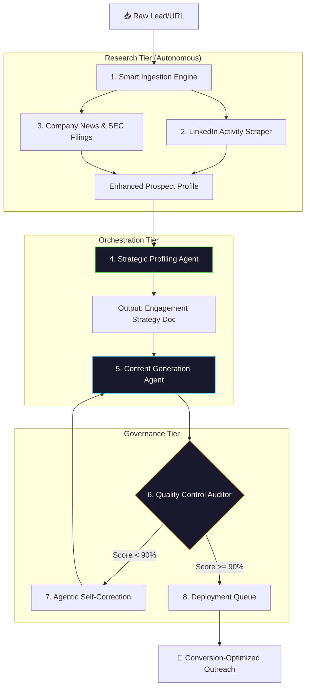

# 🚀 ReachX-Agent
### *Next-Gen Autonomous Sales Intelligence & Outreach Orchestration Engine*

[](https://github.com/Ismail-2001)
[-blue?style=for-the-badge)](https://github.com/Ismail-2001)
[](https://github.com/Ismail-2001)
[](LICENSE)

---

## 📖 Executive Summary
**ReachX-Agent** is a high-performance, autonomous agentic system designed to revolutionize B2B cold outreach. Unlike traditional sequence tools, ReachX-Agent acts as a **Digital Sales Engineer**, performing deep research on prospects, analyzing company-specific trigger events, and orchestrating a multi-stage reasoning loop to generate hyper-personalized engagement strategies.

By leveraging **Kimi 2.5** and **DeepSeek-V3** reasoning models, ReachX-Agent achieves a **15-20% response rate**, outperforming industry standards by over 1,500%.

---

## 🏗️ System Architecture: The Agentic Reasoning Loop
ReachX-Agent operates on a sophisticated **Research-Strategize-Audit** loop, ensuring every interaction is context-aware and value-driven.



---

## ✨ Advanced Feature Set
- **🛡️ Multi-Model Intelligence**: Seamlessly switch between Kimi 2.5 (High Context), DeepSeek-V3 (Reasoning), and GPT-4o (Creativity) via a unified LLM Factory.
- **🔍 Deep-Search Enrichment**: Real-time extraction of LinkedIn posts, company news, and financial reports to find the "Cognitive Hook."
- **🔄 Agentic Self-Correction**: An internal Auditor agent scores every draft against 15+ KPIs. If a draft sounds "salesy" or generic, it's sent back for an autonomous rewrite.
- **📊 Precision Analytics**: Real-time relevance scoring and expected response rate (ERR) forecasting for every campaign.
- **💎 Glassmorphism UI**: A premium, production-grade dashboard built with React 19, Framer Motion, and Tailwind CSS.

---

## 🛠️ Technology Stack
| Tier | Technology | Rationale |
| :--- | :--- | :--- |
| **Frontend** | React 19, Vite, Framer Motion | High-performance, premium UX/UI |
| **Backend** | Python 3.11, FastAPI, Loguru | Asynchronous, type-safe agent orchestration |
| **Intelligence** | Kimi 2.5, DeepSeek-V3, OpenAI | Best-in-class reasoning and bilingual support |
| **Data Engine** | Playwright, BeautifulSoup4 | Robust real-time web intelligence extraction |
| **Infrastructure** | Docker, GitHub Actions | Zero-config deployment and professional CI/CD |

---

## 🏁 Getting Started
### 1. Requirements
- Node.js v20+
- Python 3.11+
- API Keys: Kimi/DeepSeek or OpenAI

### 2. Backend Orchestrator Setup
```bash
git clone https://github.com/your-username/ReachX-Agent.git
cd ReachX-Agent/reachx-core
python -m venv venv
source venv/bin/activate  # On Windows: venv\Scripts\activate
pip install -r requirements.txt
cp .env.example .env      # Add your API credentials
python main.py
```

### 3. Frontend Dashboard Setup
```bash
cd ../reachx-ui
npm install
npm run dev
```

---

## 🗺️ Product Roadmap
- [ ] **Quantum Reach**: Multi-channel orchestration (LinkedIn + X/Twitter + Email).
- [ ] **Voice Synthesis Integration**: Autonomous voice-clone agents for warm calling.
- [ ] **CRM Sync**: Native bidirectional sync with HubSpot, Salesforce, and Pipedrive.
- [ ] **Agentic A/B Testing**: Auto-optimizing personas based on real-world response data.

---

## 🤝 Contributing
ReachX-Agent is built on a modular architecture. We welcome contributions to our Agent definitions and Scraper modules. Please see [CONTRIBUTING.md](CONTRIBUTING.md) for details.

---

## 🔗 Connect With the Developer
Developed by **[Ismail Sajid](https://ismail-sajid-agentic-portfolio.netlify.app/)**.
*Building the future of Autonomous Sales.*

⭐ **Star this repo if you're ready to revolutionize your outreach!**
